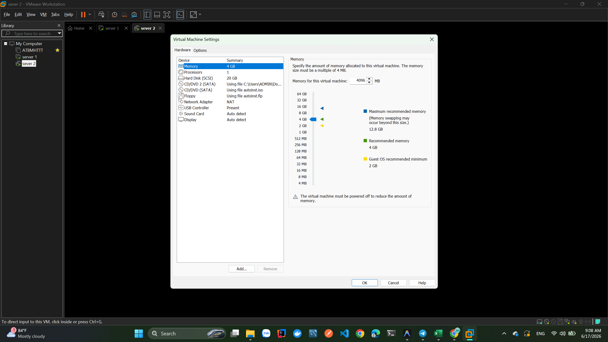
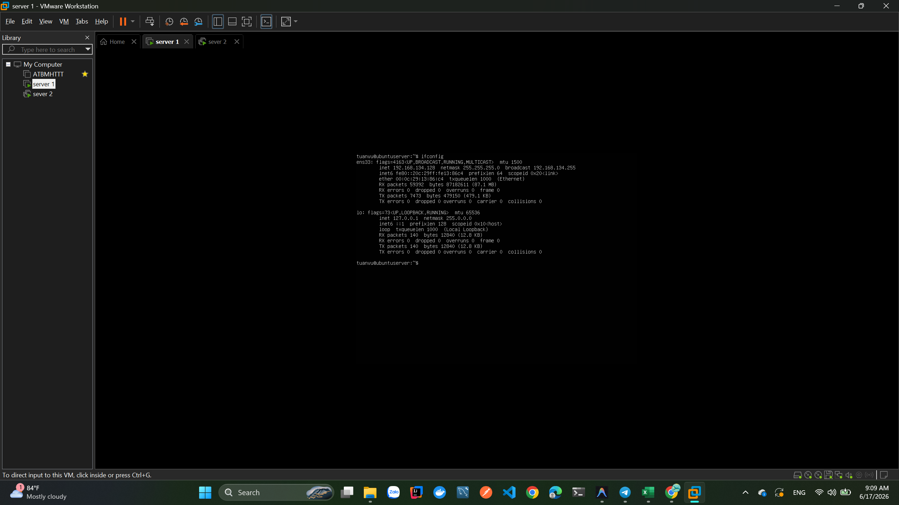
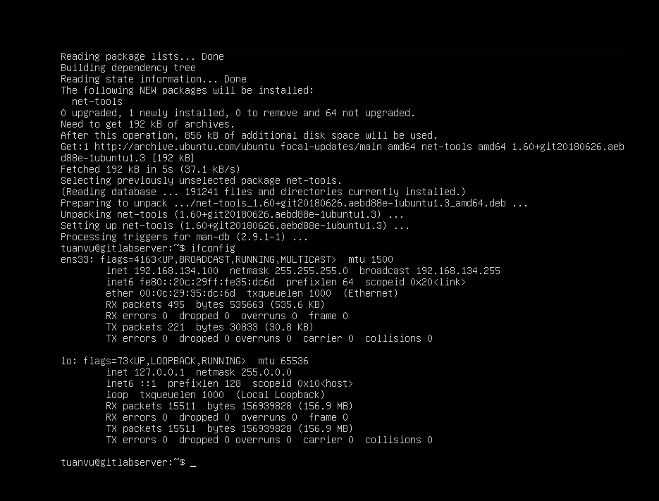
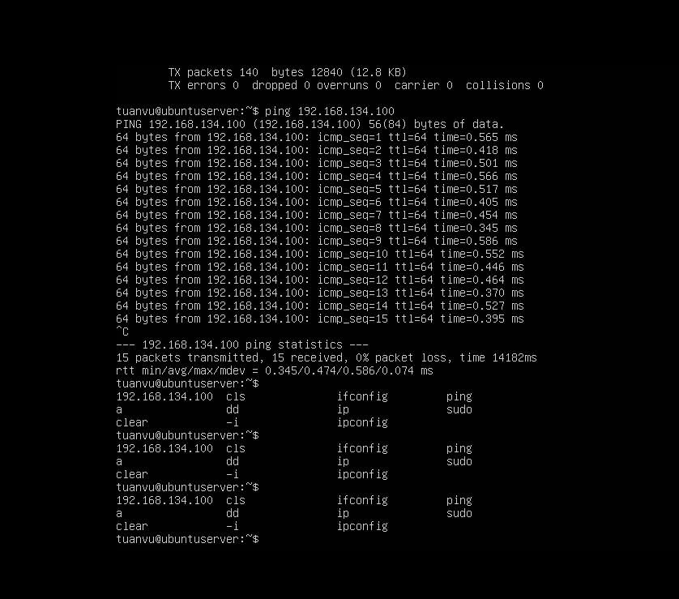
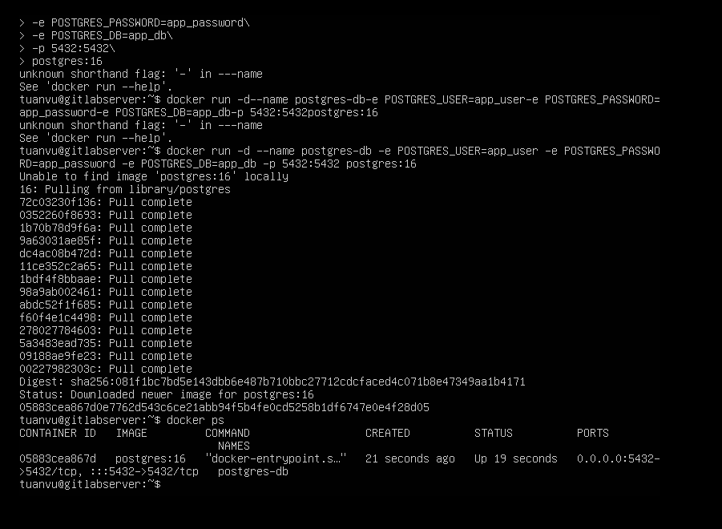
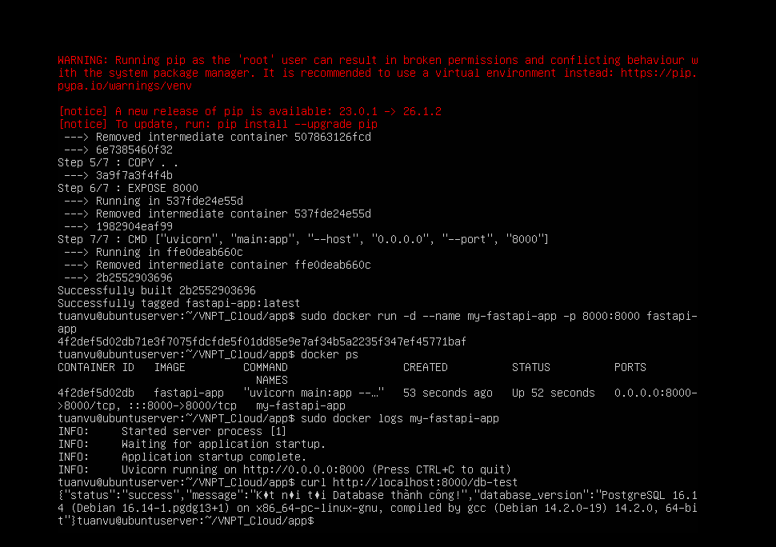
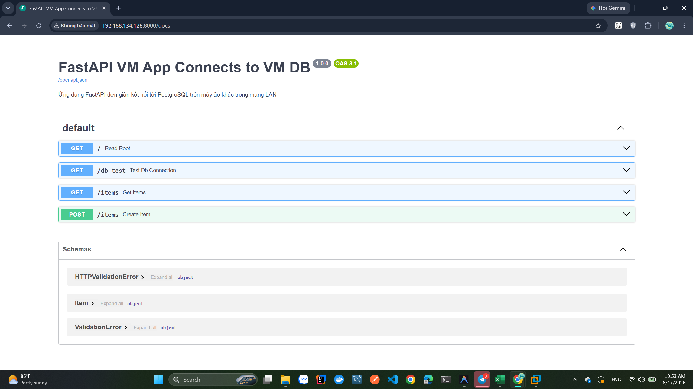

# BÁO CÁO THỰC HÀNH: TẠO MÁY ẢO, CẤU HÌNH MẠNG VÀ TRIỂN KHAI ỨNG DỤNG CONTAINER 2-TIER

* **Nội dung báo cáo:** Thực hành tạo 02 máy ảo Linux, cấu hình mạng LAN ảo, triển khai Cơ sở dữ liệu PostgreSQL trực tiếp trên VM2 và ứng dụng FastAPI đóng gói Docker trên VM1.

---

## 1. Thiết kế và Mô hình Hệ thống

Hệ thống lab được thiết kế theo mô hình 2-Tier (Web App & Database) tách biệt trên hai máy chủ ảo khác nhau cùng nằm trong một dải mạng LAN ảo:

*   **VM1 (Application Server):** Chạy ứng dụng FastAPI được đóng gói bằng **Docker Container** (Cổng 8000).
*   **VM2 (Database Server):** Chạy dịch vụ cơ sở dữ liệu **PostgreSQL** trực tiếp trên hệ điều hành (Cổng 5432).
*   **Chế độ mạng:** **NAT Mode** (VMnet8) đảm bảo hai máy ảo giao tiếp được với nhau và máy Host vật lý có thể truy cập được ứng dụng trên VM1.

---

## 2. Nhật ký các bước triển khai thực tế

### Bước 2.1: Khởi tạo máy ảo & Cấu hình phần cứng
*   Tạo 02 máy ảo Ubuntu Server trên phần mềm ảo hóa (VMware/VirtualBox).
*   Cấp phát tài nguyên tối ưu: **vCPU**: 2 Cores, **vRAM**: 2 GB, **vDisk**: 20 GB (chọn định dạng *Thin Provisioning* để tiết kiệm dung lượng đĩa vật lý của máy Host).

### Bước 2.2: Cài đặt và cấu hình PostgreSQL trên VM2
*   Cài đặt PostgreSQL: Dùng docker

### Bước 2.3: Triển khai Ứng dụng FastAPI bằng Docker trên VM1
*   Mã nguồn FastAPI kết nối PostgreSQL thông qua thư viện `psycopg2-binary` và đọc cấu hình từ file `.env`.
*   Viết `Dockerfile` đóng gói ứng dụng để tối ưu hóa việc phân phối và chạy nhanh bằng container.
*   Tiến hành build image và chạy container trên VM1:
    ```bash
    sudo docker build -t fastapi-app .
    sudo docker run -d --name my-fastapi-app -p 8000:8000 fastapi-app
    ```
*   Mở tường lửa cổng 8000 trên VM1: `sudo ufw allow 8000/tcp`.

---

## 3. Các ảnh minh chứng

### 📸 Ảnh 1: Cấu hình phần cứng máy ảo trên Hypervisor
*   **Mô tả:** Cấu hình phần cứng vCPU, vRAM, vDisk dạng mỏng và Network Adapter của cả VM1 và VM2.
*   **Hình ảnh minh chứng:**




---

### 📸 Ảnh 2: Địa chỉ IP và Kết nối mạng (Ping test)
*   **Mô tả:** Địa chỉ IP của VM1, VM2 và kết quả chạy lệnh ping thông mạng LAN ảo thành công.
*   **Hình ảnh minh chứng:**







---

### 📸 Ảnh 3: Trạng thái cơ sở dữ liệu hoạt động trên VM2
*   **Mô tả:** Dịch vụ PostgreSQL trên VM2 đang hoạt động ổn định.
*   **Hình ảnh minh chứng:**



---

### 📸 Ảnh 4: Lệnh build Docker và trạng thái container trên VM1
*   **Mô tả:** Kết quả chạy lệnh container trạng thái `Up` và không bị lỗi kết nối DB.
*   **Hình ảnh minh chứng:**



---

### 📸 Ảnh 5: Kiểm tra ứng dụng từ máy Host vật lý (Swagger UI)
*   **Mô tả:** Truy cập thành công vào giao diện Swagger UI `/docs` và chạy thử endpoint `/db-test` hiển thị kết quả thành công kết nối tới DB.
*   **Hình ảnh minh chứng:**


