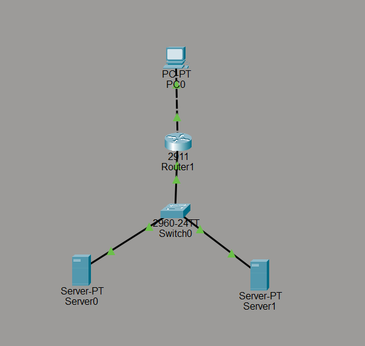
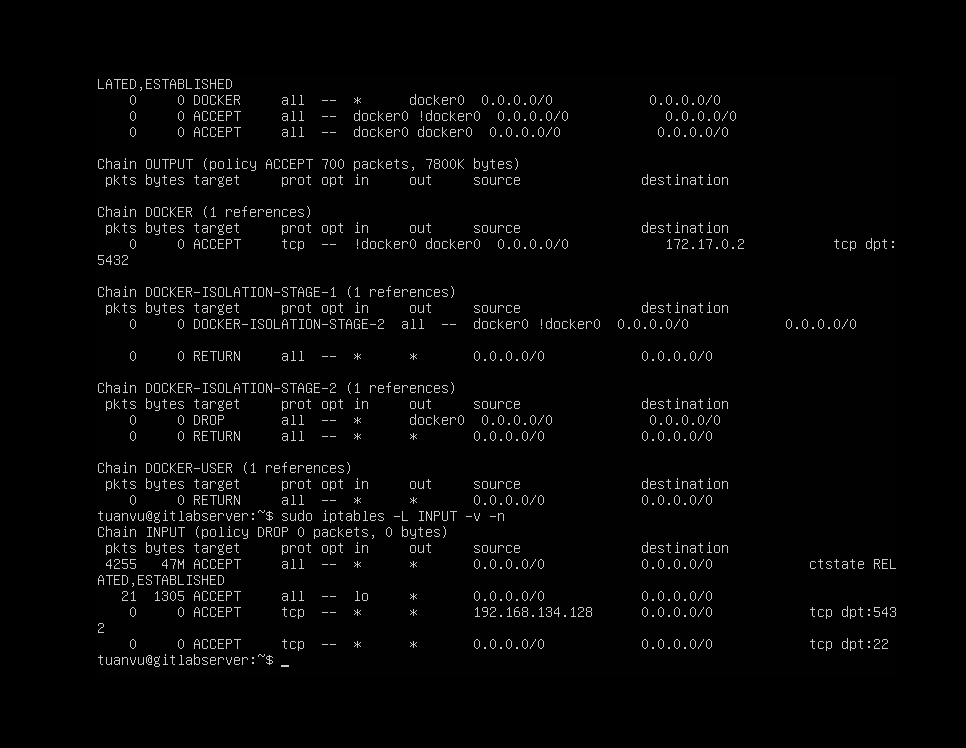
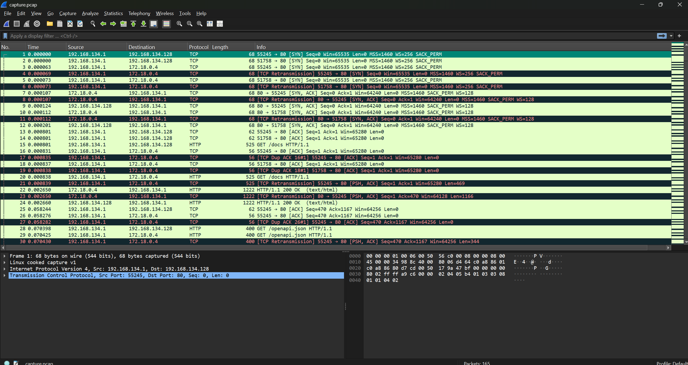

# BÁO CÁO THỰC HÀNH - PHẦN 3: GIẢ LẬP MẠNG, ĐỊNH TUYẾN TĨNH, FIREWALL VÀ LOAD BALANCER (MÔ HÌNH 2-VM)

* **Nội dung thực hành:** Thiết kế sơ đồ mạng giả lập, cấu hình định tuyến tĩnh (Static Route) giữa máy Host và các máy ảo, triển khai cụm cân bằng tải HAProxy kết nối tới 2 container FastAPI (High Availability) trên VM1 kết nối về Database PostgreSQL trên VM2, thiết lập tường lửa (iptables) bảo mật cơ sở dữ liệu và bắt gói tin (tcpdump/Wireshark) để phân tích giao thức.

---

## 1. Thiết kế và Sơ đồ mạng hệ thống (Topology)

Hệ thống lab được thiết kế theo mô hình 2-Tier phân tách rạch ròi giữa phân vùng ứng dụng (Web) chạy trên VM1 và phân vùng dữ liệu (Database) chạy trên VM2, kết nối qua mạng LAN ảo:

```mermaid
graph TD
    subgraph Máy Host vật lý (Windows)
        Browser[Trình duyệt Web máy Host<br>IP: 192.168.134.1]
    end

    subgraph Máy ảo VM1: Application Server (IP: 192.168.134.128)
        direction TB
        LB_Cont[Container: HAProxy<br>Cổng 80]
        Web1_Cont[Container: FastAPI Web 1<br>Cổng 8000 (Ẩn)]
        Web2_Cont[Container: FastAPI Web 2<br>Cổng 8000 (Ẩn)]
        
        LB_Cont -->|Round Robin| Web1_Cont
        LB_Cont -->|Round Robin| Web2_Cont
    end

    subgraph Máy ảo VM2: Database Server (IP: 192.168.134.100)
        DB[(Dịch vụ PostgreSQL<br>Cổng 5432)]
    end

    Browser --->|Truy cập Cổng 80| LB_Cont
    Web1_Cont --->|Kết nối Cổng 5432| DB
    Web2_Cont --->|Kết nối Cổng 5432| DB
```

*   **VM1 (Application Server - IP: 192.168.134.128):** Sử dụng **Docker Compose** để quản lý và chạy cụm 3 container: 1 HAProxy (chốt chặn đầu vào cổng 80) và 2 Web App FastAPI chạy song song để đảm bảo tính sẵn sàng cao (High Availability).
*   **VM2 (Database Server - IP: 192.168.134.100):** Chạy hệ quản trị cơ sở dữ liệu **PostgreSQL** trực tiếp trên hệ điều hành của máy ảo (hoặc trong 1 container độc lập).
*   **Mạng kết nối:** Sử dụng chế độ mạng **NAT Mode** (VMnet8) kết nối máy Host Windows, VM1, và VM2 cùng nằm trong dải mạng `192.168.134.0/24`.

---

## 2. Chi tiết các nội dung cấu hình thực tế

### Bước 2.1: Cấu hình Định tuyến tĩnh (Static Route)
*Thực tế, vì máy Host (192.168.134.1) và các máy ảo đều đang kết nối trực tiếp vào mạng VMnet8 (192.168.134.0/24) nên chúng đã có thể giao tiếp trực tiếp. Để thực hiện bài lab cấu hình định tuyến tĩnh (Static Route), ta giả lập một mạng nội bộ khác ở chi nhánh có dải IP là `172.16.10.0/24` kết nối sau máy ảo VM1.*

*   **Trên Windows (Máy Host):** Mở Command Prompt (quyền Administrator) và cấu hình định tuyến tĩnh trỏ dải mạng giả lập `172.16.10.0/24` đi qua VM1 (`192.168.134.128`) làm gateway định tuyến:
    ```cmd
    route add 172.16.10.0 mask 255.255.255.0 192.168.134.128 -p
    ```
*   **Trên VM1 (Linux - Router đóng vai trò chuyển tiếp):** Bật tính năng định tuyến chuyển tiếp gói tin (IP Forwarding) trên nhân Linux:
    ```bash
    sudo sysctl -w net.ipv4.ip_forward=1
    ```
*   **Kiểm tra bảng định tuyến trên máy Host và VM1:**
    ```cmd
    # Trên Windows
    route print
    
    # Trên Linux
    ip route show
    ```


---

### Bước 2.2: Triển khai Cụm Web App & Load Balancer trên VM1
Chúng ta sử dụng Docker Compose để tự động hóa quá trình build và khởi chạy cụm dịch vụ.

1.  **File cấu hình `docker-compose.yml` (tại `/home/tuanvu/VNPT_Cloud/app/`):**
    ```yaml
    version: '3.8'
    services:
      web1:
        build: .
        container_name: web_app_1
        env_file:
          - .env
        expose:
          - "8000"
        restart: always

      web2:
        build: .
        container_name: web_app_2
        env_file:
          - .env
        expose:
          - "8000"
        restart: always

      haproxy:
        image: haproxy:2.8-alpine
        container_name: load_balancer_haproxy
        volumes:
          - ./haproxy/haproxy.cfg:/usr/local/etc/haproxy/haproxy.cfg:ro
        ports:
          - "80:80"
        depends_on:
          - web1
          - web2
        restart: always
    ```
2.  **File cấu hình HAProxy `haproxy/haproxy.cfg`:**
    ```ini
    global
        log stdout format raw local0 info

    defaults
        log     global
        mode    http
        timeout connect 5s
        timeout client  50s
        timeout server  50s

    frontend http_front
        bind *:80
        default_backend web_servers

    backend web_servers
        balance roundrobin
        server web_instance_1 web1:8000 check
        server web_instance_2 web2:8000 check
    ```
3.  **Khởi động cụm dịch vụ:**
    ```bash
    sudo docker compose up -d
    ```

---

### Bước 2.3: Cấu hình Tường lửa (Firewall) bảo mật hệ thống
Thiết lập tường lửa chặt chẽ trên máy chủ cơ sở dữ liệu để bảo vệ dữ liệu và phân tách quyền truy cập.

*   **Cấu hình trên VM2 (Database Server - 192.168.134.100) bằng `iptables`:**
    Chỉ cho phép IP của máy chủ ứng dụng **VM1 (192.168.134.128)** truy cập trực tiếp vào cơ sở dữ liệu PostgreSQL (cổng 5432). Chặn toàn bộ truy cập trực tiếp từ các IP khác (bao gồm cả máy Host Windows).
    ```bash
    # 1. Cho phép các kết nối đang duy trì
    sudo iptables -A INPUT -m conntrack --ctstate ESTABLISHED,RELATED -j ACCEPT
    
    # 2. Cho phép kết nối local (localhost)
    sudo iptables -A INPUT -i lo -j ACCEPT
    
    # 3. Chỉ cho phép IP của VM1 (App Server) truy cập cổng 5432
    sudo iptables -A INPUT -p tcp -s 192.168.134.128 --dport 5432 -j ACCEPT
    
    # 4. Cho phép cổng SSH (22) để quản trị viên truy cập
    sudo iptables -A INPUT -p tcp --dport 22 -j ACCEPT
    
    # 5. Cấu hình chính sách mặc định: DROP tất cả kết nối ngoài luồng trên
    sudo iptables -P INPUT DROP
    ```
*   **Cấu hình trên Windows Host (Windows Defender Firewall):**
    Thiết lập Block ICMP Inbound Rule để chặn phản hồi Ping nhằm bảo mật máy Host.

---

### Bước 2.4: Bắt và phân tích gói tin với `tcpdump` & `Wireshark`
1.  **Chạy tcpdump trên VM1 (Load Balancer) để bắt lưu lượng mạng đi vào cổng 80:**
    ```bash
    sudo tcpdump -i any port 80 -w ../images/network_capture.pcap
    ```
2.  Dùng trình duyệt từ máy Host truy cập vào web để tạo luồng dữ liệu, sau đó dừng `tcpdump`.
3.  Tải file `network_capture.pcap` về máy Host và phân tích quá trình bắt tay 3 bước của TCP trên phần mềm Wireshark.

---

## 3. Các ảnh minh chứng kết quả cần đạt được

### Ảnh 1: Sơ đồ mạng giả lập thiết kế thực tế (Packet Tracer / GNS3 / EVE-NG)
*   **Mô tả nội dung cần chụp:** Chụp toàn bộ sơ đồ mạng logic bạn đã thiết kế trên phần mềm giả lập, hiển thị các thiết bị (Router, Switch, Máy ảo) cùng dải địa chỉ IP đã gán.
*   **Hình ảnh minh chứng:**



---

### Ảnh 2: Cấu hình định tuyến tĩnh (Static Route) trên Windows & Linux
*   **Mô tả nội dung cần chụp:** 
    *   Trên máy Host Windows: Chụp màn hình CMD chạy lệnh `route print` hiển thị dải IP `192.168.134.0/24` đã được định tuyến qua Gateway.
    *   Trên máy ảo Linux VM1/VM2: Chụp màn hình Terminal chạy lệnh `ip route show` hiển thị bảng định tuyến.
*   **Hình ảnh minh chứng:**


---

###  Ảnh 3: Cấu hình HAProxy và Kết quả Cân bằng tải hoạt động
*   **Mô tả nội dung cần chụp:** 
    *   Trình duyệt trên máy Host truy cập vào IP của Load Balancer cổng 80 (`http://192.168.134.128/`). Khi refresh thấy kết quả thay đổi luân phiên giữa Web 1 và Web 2.
    *   **Minh chứng tính HA:** Chạy lệnh `docker stop web_app_1` trên VM1, tải lại trang web vẫn truy cập bình thường qua container `web_app_2`.
*   **Hình ảnh minh chứng:**


---

###  Ảnh 4: Tường lửa iptables trên VM2 bảo vệ Database thành công
*   **Mô tả nội dung cần chụp:** 
    *   Trên VM2: Chụp màn hình Terminal gõ lệnh `sudo iptables -L -v -n` hiển thị quy tắc DROP mặc định và chỉ cho phép IP VM1 kết nối cổng 5432.
    *   Trên máy Host: Chụp màn hình CMD chạy lệnh `telnet 192.168.134.100 5432` hoặc ping báo kết nối thất bại (do bị chặn), chứng minh tường lửa chặn đúng đối tượng.
*   **Hình ảnh minh chứng:**



---

### Ảnh 5: Bắt gói tin và phân tích trên Wireshark
*   **Mô tả nội dung cần chụp:** Giao diện phần mềm Wireshark mở file `.pcap` bắt được từ lệnh `tcpdump` trên VM1. Hiển thị rõ tiến trình bắt tay 3 bước của TCP (SYN, SYN-ACK, ACK) và gói tin yêu cầu HTTP GET.
*   **Hình ảnh minh chứng:**



