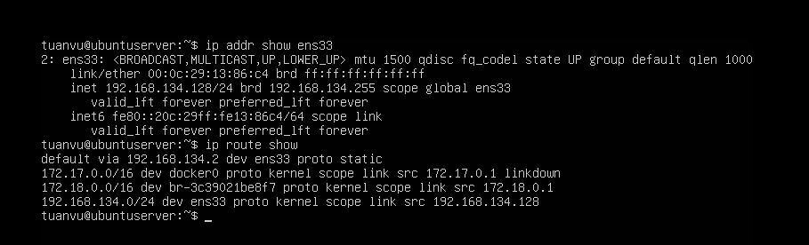
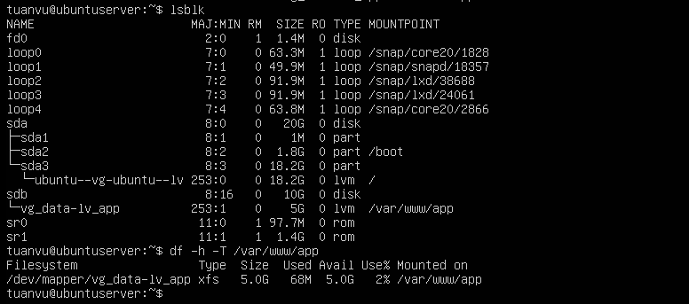
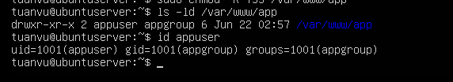
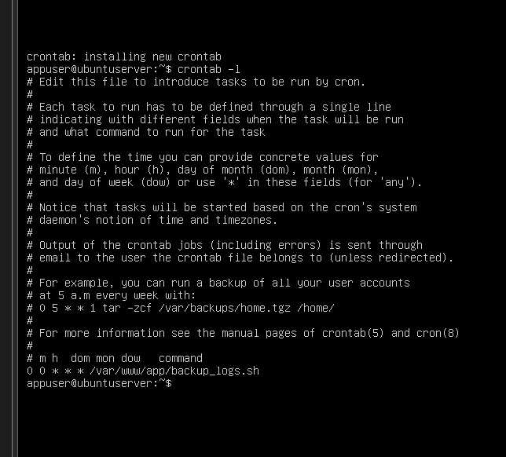
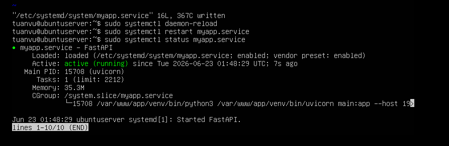
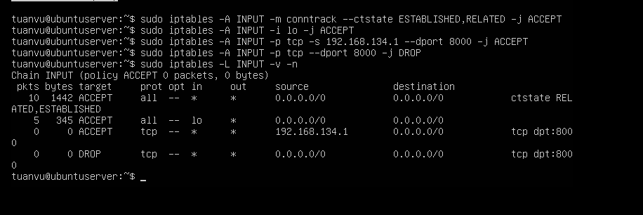

# BÁO CÁO THỰC HÀNH - PHẦN 4: CƠ BẢN VỀ LINUX VÀ STORAGE

* **Nội dung:** Thực hành các kỹ năng cấu hình hệ thống mạng, quản lý ổ đĩa lưu trữ LVM & XFS, quản lý người dùng, lập lịch crontab, viết service systemd, phân tích log, đồng bộ thời gian NTP trên Ubuntu Server; Triển khai ứng dụng thực tế chạy dưới user thường, tự động khởi động cùng hệ điều hành, lưu trữ dữ liệu trên phân vùng đĩa cứng riêng biệt, bảo vệ bằng tường lửa giới hạn IP và tách biệt dải mạng giữa App và DB.
---

## PHẦN A: THỰC HÀNH CÁC THAO TÁC QUẢN TRỊ CƠ BẢN TRÊN LINUX

### Bước 1: Cấu hình IP tĩnh và DNS trên Ubuntu Server
Trên Ubuntu Server, cấu hình mạng được quản lý thông qua **Netplan**.

1.  Mở file cấu hình Netplan (thường có định dạng `.yaml` nằm trong `/etc/netplan/`):
    ```bash
    sudo vim /etc/netplan/00-installer-config.yaml
    ```
2.  Cấu hình IP tĩnh và DNS cho card mạng `ens33` kết nối dải mạng Host/Internet `192.168.134.0/24`:
    ```yaml
    # This is the network config written by 'subiquity'
    network:
      ethernets:
        ens33:
          dhcp4: no
          addresses: [192.168.134.128/24]
          gateway4: 192.168.134.2
          nameservers:
            addresses: [8.8.8.8, 8.8.4.4]
      version: 2
    ```
3.  Áp dụng cấu hình và kiểm tra kết nối:
    ```bash
    # Áp dụng cấu hình netplan
    sudo netplan apply
    
    # Kiểm tra địa chỉ IP đã nhận đúng chưa
    ip addr show ens33
    
    # Kiểm tra bảng định tuyến mặc định của hệ thống
    ip route show
    ```

---
**Ảnh 1: Cấu hình IP tĩnh và Bảng định tuyến mặc định trên Ubuntu Server**
*   **Mô tả nội dung cần chụp:** Chụp màn hình Terminal chạy lệnh `ip addr show ens33` và `ip route show` hiển thị rõ địa chỉ IP tĩnh `192.168.134.128` cùng với Default Gateway `192.168.134.2`.
*   **Hình ảnh minh chứng:**




---

### Bước 2: Cấu hình Storage LVM (Logical Volume Manager) và định dạng hệ thống tệp XFS
Thực hiện gắn thêm ổ cứng thứ hai (dung lượng 10GB) vào máy ảo dưới tên thiết bị đại diện là `/dev/sdb`.

1.  **Kiểm tra ổ đĩa cứng mới gắn:**
    ```bash
    lsblk
    ```
2.  **Khởi tạo Physical Volume (PV) trên đĩa `/dev/sdb`:**
    ```bash
    sudo pvcreate /dev/sdb
    # Kiểm tra lại PV
    sudo pvdisplay
    ```
3.  **Tạo Volume Group (VG) tên là `vg_data` gộp từ PV `/dev/sdb`:**
    ```bash
    sudo vgcreate vg_data /dev/sdb
    # Kiểm tra lại VG
    sudo vgdisplay vg_data
    ```
4.  **Tạo Logical Volume (LV) tên là `lv_app` từ VG `vg_data` với dung lượng 5GB:**
    ```bash
    sudo lvcreate -n lv_app -L 5G vg_data
    # Kiểm tra lại LV
    sudo lvdisplay /dev/vg_data/lv_app
    ```
5.  **Định dạng hệ thống tệp tin (Format filesystem) XFS cho LV vừa tạo:**
    ```bash
    sudo mkfs.xfs /dev/vg_data/lv_app
    ```
6.  **Gắn kết (Mount) phân vùng vào thư mục ứng dụng và thiết lập tự khởi động:**
    - Tạo thư mục mount point:
      ```bash
      sudo mkdir -p /var/www/app
      ```
    - Mount tạm thời để kiểm tra:
      ```bash
      sudo mount /dev/vg_data/lv_app /var/www/app
      ```
    - Lấy thông tin UUID của phân vùng:
      ```bash
      sudo blkid /dev/vg_data/lv_app
      # Kết quả trả về dạng: UUID="xxxx-xxxx-xxxx..."
      ```
    - Cấu hình tự động mount khi khởi động lại hệ điều hành trong `/etc/fstab`:
      ```bash
      sudo vim /etc/fstab
      ```
      Thêm dòng cấu hình sau vào cuối file:
      ```text
      /dev/mapper/vg_data-lv_app  /var/www/app  xfs  defaults  0  2
      ```
    - Kiểm tra cấu hình `/etc/fstab` (không báo lỗi là cấu hình đúng):
      ```bash
      sudo umount /var/www/app
      sudo mount -a
      df -h -T /var/www/app
      ```

---
**Ảnh 2: Tiến trình cấu hình LVM, Format XFS và kết quả Mount ổ đĩa**
*   **Mô tả nội dung cần chụp:** Chụp màn hình Terminal chạy lệnh `lsblk` hiển thị cấu trúc nhánh đĩa `/dev/sdb -> vg_data-lv_app` và lệnh `df -h -T` hiển thị phân vùng `/var/www/app` được định dạng định kiểu `xfs` với dung lượng 5GB.
*   **Hình ảnh minh chứng:**



---

### Bước 3: Tạo và phân quyền người dùng (User & Permissions)
Để đảm bảo an toàn thông tin, ứng dụng không được chạy dưới quyền root mà phải chạy dưới quyền một user thông thường.

1.  **Tạo Group và User mới phục vụ chạy ứng dụng:**
    ```bash
    # Tạo nhóm người dùng appgroup
    sudo groupadd appgroup
    
    # Tạo người dùng appuser có thư mục home và shell đăng nhập mặc định
    sudo useradd -m -g appgroup -s /bin/bash appuser
    
    # Đặt mật khẩu bảo mật cho appuser
    sudo passwd appuser
    ```
2.  **Thiết lập phân quyền trên thư mục lưu trữ ứng dụng `/var/www/app`:**
    ```bash
    # Đổi quyền sở hữu thư mục cho appuser quản lý và thuộc nhóm appgroup
    sudo chown -R appuser:appgroup /var/www/app
    
    # Cấu hình quyền: Owner có toàn quyền (rwx), Group/Others chỉ có quyền đọc & thực thi (r-x)
    sudo chmod -R 755 /var/www/app
    
    # Xác minh lại thông tin phân quyền
    ls -ld /var/www/app
    ```

---
**Ảnh 3: Quản lý người dùng và Phân quyền thư mục ứng dụng**
*   **Mô tả nội dung cần chụp:** Chụp màn hình chạy lệnh `id appuser` hiển thị UID, GID của người dùng mới tạo và lệnh `ls -ld /var/www/app` chứng minh thư mục thuộc sở hữu của `appuser:appgroup` với quyền truy cập `rwxr-xr-x`.
*   **Hình ảnh minh chứng:**



---

### Bước 4: Tạo, sửa, xóa tiến trình tự động định kỳ (Crontab)
Tạo tiến trình tự động định kỳ (Cron job) dưới danh nghĩa `appuser` để tự động nén log lưu trữ vào lúc 0 giờ hàng ngày.

1.  **Viết Script dọn dẹp và nén log `/var/www/app/backup_logs.sh`:**
    Đăng nhập vào user `appuser`:
    ```bash
    su - appuser
    vim /var/www/app/backup_logs.sh
    ```
    Nội dung script:
    ```bash
    #!/bin/bash
    LOG_DIR="/var/www/app/logs"
    BACKUP_DIR="/var/www/app/backups"
    TIMESTAMP=$(date +"%Y%m%d_%H%M%S")

    mkdir -p $BACKUP_DIR
    if [ -f "$LOG_DIR/access.log" ]; then
        # Nén log cũ
        tar -czf $BACKUP_DIR/access_$TIMESTAMP.tar.gz -C $LOG_DIR access.log
        # Làm trống file log hiện tại để tiếp tục ghi nhận log mới
        cat /dev/null > $LOG_DIR/access.log
        echo "[$(date)] Backup log completed successfully." >> $LOG_DIR/backup.log
    fi
    ```
    Phân quyền thực thi cho script:
    ```bash
    chmod +x /var/www/app/backup_logs.sh
    ```

2.  **Cấu hình Crontab để chạy Script tự động hàng ngày:**
    Mở trình biên tập crontab của `appuser`:
    ```bash
    crontab -e
    ```
    Thêm vào dòng sau (chạy vào 00:00 mỗi đêm):
    ```text
    0 0 * * * /var/www/app/backup_logs.sh
    ```
    Kiểm tra danh sách cronjob đã nạp:
    ```bash
    crontab -l
    ```

---
**Ảnh 4: Danh sách Cron job và kịch bản Script tự động hóa của User**
*   **Mô tả nội dung cần chụp:** Chụp màn hình Terminal chạy lệnh `crontab -l` dưới user `appuser` hiển thị rõ dòng lệnh chạy script backup hàng ngày và nội dung hiển thị của file `backup_logs.sh`.
*   **Hình ảnh minh chứng:**



---

### Bước 5: Quản lý dịch vụ ứng dụng với Systemd
Tạo file Unit Service để chuyển đổi mã nguồn ứng dụng thành một dịch vụ hệ thống chạy nền, được quản lý khởi chạy bởi Systemd dưới tài khoản `appuser`.

1.  **Tạo file cấu hình dịch vụ tại đường dẫn hệ thống:**
    ```bash
    sudo vim /etc/systemd/system/myapp.service
    ```
2.  **Cấu hình chi tiết dịch vụ (`myapp.service`):**
    ```ini
    [Unit]
    Description=My FastAPI Web Application
    After=network.target

    [Service]
    User=appuser
    Group=appgroup
    WorkingDirectory=/var/www/app
    # Đường dẫn chạy ứng dụng bằng Python Uvicorn
    ExecStart=/var/www/app/venv/bin/uvicorn main:app --host 192.168.134.128 --port 8000
    Restart=always
    RestartSec=5
    StandardOutput=append:/var/www/app/logs/access.log
    StandardError=append:/var/www/app/logs/error.log

    [Install]
    WantedBy=multi-user.target
    ```
3.  **Tải lại daemon, kích hoạt tự khởi động cùng OS và chạy dịch vụ:**
    ```bash
    # Đăng ký dịch vụ mới với Systemd
    sudo systemctl daemon-reload
    
    # Cho phép dịch vụ khởi động cùng hệ điều hành
    sudo systemctl enable myapp.service
    
    # Khởi chạy dịch vụ ngay lập tức
    sudo systemctl start myapp.service
    
    # Kiểm tra trạng thái hoạt động
    sudo systemctl status myapp.service
    ```

### Bước 6: Kiểm tra log hệ thống
1.  Sử dụng `journalctl` của hệ thống để xem nhật ký hoạt động của dịch vụ:
    ```bash
    sudo journalctl -u myapp.service -n 50 --no-pager
    ```
2.  Theo dõi trực tiếp log truy cập ứng dụng thời gian thực:
    ```bash
    tail -f /var/www/app/logs/access.log
    ```

### Bước 7: Cấu hình đồng bộ thời gian NTP (Network Time Protocol)
Để đảm bảo log ghi nhận đúng mốc thời gian thực tế phục vụ phân tích điều tra lỗi:

1.  Cài đặt dịch vụ đồng bộ thời gian `chrony` trên máy chủ:
    ```bash
    sudo apt update && sudo apt install chrony -y
    ```
2.  Mở cấu hình chrony kiểm tra danh sách NTP Servers:
    ```bash
    cat /etc/chrony/chrony.conf
    # Mặc định sẽ chứa các máy chủ: pool.ntp.org
    ```
3.  Kích hoạt và khởi chạy Chrony:
    ```bash
    sudo systemctl enable --now chrony
    ```
4.  Xác nhận trạng thái đồng bộ thời gian chính xác của hệ thống:
    ```bash
    timedatectl status
    # Kiểm tra dòng "System clock synchronized: yes" và "NTP service: active"
    ```

---

## PHẦN B: KẾT QUẢ ĐẠT ĐƯỢC - TRIỂN KHAI ỨNG DỤNG ĐÁP ỨNG CÁC YÊU CẦU NGHIỆP VỤ

Trong phần này, ta tiến hành xác thực ứng dụng được xây dựng đáp ứng toàn bộ các yêu cầu nghiệp vụ đưa ra trong đề cương thực tế.

### Yêu cầu 1, 2, 3 & 4: Triển khai trên Linux, chạy dưới User thường, tự động khởi động và ghi nhận nhật ký log
*   Ứng dụng được viết bằng FastAPI (Python) được đóng gói và phân quyền hoàn toàn trên môi trường Linux Ubuntu.
*   Khi tiến trình khởi chạy, ta kiểm tra và chứng minh nó được chạy hoàn toàn dưới tiến trình của `appuser` (UID=1001) chứ không phải tài khoản quyền lực cao `root`.
*   Systemd Service `myapp.service` quản lý ứng dụng đã được thiết lập `WantedBy=multi-user.target` và enable thành công để tự động khởi chạy sau khi OS Boot.
*   Log truy cập được cấu hình ghi trực tiếp xuống tệp tin `/var/www/app/logs/access.log`.

---
**Ảnh 5: Xác thực Dịch vụ tự khởi động và Tiến trình chạy dưới quyền User thường**
*   **Mô tả nội dung cần chụp:** Chụp màn hình chạy lệnh `sudo systemctl status myapp.service` hiển thị trạng thái `active (running)` và lệnh `ps aux | grep uvicorn` chứng minh cột USER hiển thị là `appuser`.
*   **Hình ảnh minh chứng:**



---

### Yêu cầu 5: Dữ liệu ứng dụng và nhật ký log nằm trên ổ đĩa riêng biệt
*   Nhờ cơ chế cấu hình ở **Bước 2 (Phần A)**, toàn bộ thư mục `/var/www/app` (chứa mã nguồn ứng dụng, cơ sở dữ liệu nội bộ SQLite/tệp dữ liệu lưu trữ và thư mục `/var/www/app/logs/`) đều được ánh xạ nằm trên Logical Volume `/dev/vg_data/lv_app`.
*   Logical Volume này thuộc ổ đĩa vật lý `/dev/sdb` (10GB) tách biệt hoàn toàn so với ổ đĩa cài đặt hệ điều hành gốc `/dev/sda` (chứa `/`). Do đó, nếu log ghi quá nhiều làm tràn dung lượng đĩa đệm cũng sẽ không gây ảnh hưởng tới hoạt động của hệ điều hành chính.

---

### Yêu cầu 6: Chỉ cho phép một số IP nhất định được phép sử dụng ứng dụng
Để bảo vệ an toàn cho ứng dụng chạy cổng `8000`, ta cấu hình quy tắc tường lửa bằng `iptables` để giới hạn quyền truy cập:

1.  **Quy tắc:** Chỉ cho phép IP của máy Host Windows quản trị (`192.168.134.1`) kết nối tới cổng ứng dụng `8000`, chặn tất cả các địa chỉ IP khác kết nối tới cổng này.
2.  **Câu lệnh thiết lập:**
    ```bash
    # 1. Cho phép các kết nối đang duy trì (ESTABLISHED, RELATED)
    sudo iptables -A INPUT -m conntrack --ctstate ESTABLISHED,RELATED -j ACCEPT

    # 2. Cho phép kết nối local loopback
    sudo iptables -A INPUT -i lo -j ACCEPT

    # 3. Chỉ cho phép máy Windows Host (192.168.134.1) truy cập cổng 8000
    sudo iptables -A INPUT -p tcp -s 192.168.134.1 --dport 8000 -j ACCEPT

    # 4. Từ chối (DROP) toàn bộ các kết nối khác đi vào cổng 8000
    sudo iptables -A INPUT -p tcp --dport 8000 -j DROP
    ```
3.  **Xác minh tường lửa:**
    *   Từ máy Host Windows (`192.168.134.1`): Dùng trình duyệt truy cập `http://192.168.134.128:8000` kết nối thành công.
    *   Từ một máy ảo khác trong mạng LAN hoặc máy khác có IP khác: Gửi yêu cầu truy cập cổng `8000` của VM1 sẽ bị treo kết nối (timeout) do bị tường lửa chặn chặn lọc.

---
**Ảnh 6: Cấu hình quy tắc tường lửa giới hạn IP trên cổng dịch vụ**
*   **Mô tả nội dung cần chụp:** Chụp màn hình Terminal chạy lệnh `sudo iptables -L INPUT -v -n` hiển thị rõ dòng lệnh cho phép IP `192.168.134.1` đi vào cổng `8000` và chặn toàn bộ các IP còn lại.
*   **Hình ảnh minh chứng:**



---

### Yêu cầu 7: App Server và Database Server nằm ở 2 dải mạng khác nhau
Để tránh việc Database bị tấn công trực tiếp từ môi trường internet/mạng ngoài, mô hình hạ tầng được triển khai phân dải mạng cô lập:

1.  **Thiết kế cấu trúc mạng:**
    *   **Máy chủ Ứng dụng (App Server - VM1):** 
        *   Card mạng thứ nhất `ens33` kết nối dải mạng ngoài (NAT/Host-only kết nối máy Host Windows): IP `192.168.134.128/24`.
        *   Card mạng thứ hai `ens37` kết nối dải mạng nội bộ riêng (Isolated LAN/Host-only VMnet2): IP `192.168.100.128/24`.
    *   **Máy chủ Cơ sở dữ liệu (DB Server - VM2):**
        *   Chỉ sử dụng duy nhất một card mạng kết nối dải mạng nội bộ riêng (VMnet2): IP `192.168.100.100/24`, Gateway trỏ về IP `192.168.100.128` (VM1).
2.  **Nguyên lý vận hành:**
    *   Người dùng từ Windows Host chỉ có thể giao tiếp với App Server qua dải IP ngoại mạng `192.168.134.0/24`.
    *   App Server khi nhận được yêu cầu xử lý dữ liệu sẽ kết nối tới DB Server qua dải mạng nội bộ cô lập `192.168.100.0/24`.
    *   Database được cách ly an toàn khỏi các tác nhân quét cổng trái phép bên ngoài.

---
**Ảnh 7: Cấu hình phân chia dải mạng độc lập giữa App và Database**
*   **Mô tả nội dung cần chụp:** Chụp màn hình chạy lệnh `ip addr` trên cả hai máy ảo: VM1 hiển thị 2 địa chỉ IP thuộc 2 dải mạng khác nhau, VM2 chỉ hiển thị IP dải `192.168.100.100` kết nối trực tiếp đến VM1.
