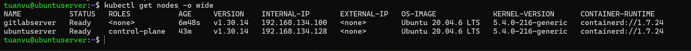

# BÁO CÁO THỰC HÀNH - PHẦN 5: CƠ BẢN VỀ KUBERNETES

* **Nội dung thực hành:** Tiến hành cài đặt cụm Kubernetes (K8s) Cluster chuẩn bằng **kubeadm** gồm 2 Node (Master Node trên VM1 và Worker Node trên VM2); cấu hình Container Runtime Containerd; cài đặt Flannel CNI và bộ cân bằng tải MetalLB; Viết các file cấu hình Manifests triển khai ứng dụng FastAPI (2 replicas chạy HA) và PostgreSQL Database sử dụng Persistent Storage (PV/PVC HostPath); Thực hiện thay đổi cấu hình qua ConfigMap, nâng cấp và quay lui (Rollback) phiên bản ứng dụng; Kiểm tra tính năng chịu lỗi High Availability (HA) khi tắt 1 Node.
---

## 1. Cài đặt cụm Kubernetes (K8s) Cluster bằng kubeadm (2-Node)

Để thiết lập một cụm Kubernetes chuẩn phục vụ học tập và thực hành thực tế, ta sử dụng công cụ chính thức **kubeadm** để xây dựng cụm 2 Node kết nối qua dải IP mạng NAT (VMnet8):
*   **Master Node (VM1):** IP `192.168.134.128` (ens33)
*   **Worker Node (VM2):** IP `192.168.134.100` (ens33)

### Bước 1.1: Chuẩn bị môi trường hệ thống (Thực hiện trên cả VM1 và VM2)
1.  **Tắt Swap (yêu cầu bắt buộc của K8s):**
    ```bash
    sudo swapoff -a
    sudo sed -i '/ swap / s/^\(.*\)$/#\1/g' /etc/fstab
    ```
2.  **Cấu hình nạp Kernel Modules và Sysctl cho K8s networking:**
    ```bash
    # Nạp các module cần thiết
    sudo modprobe overlay
    sudo modprobe br_netfilter

    cat <<EOF | sudo tee /etc/modules-load.d/k8s.conf
    overlay
    br_netfilter
    EOF

    # Cấu hình tham số sysctl
    cat <<EOF | sudo tee /etc/sysctl.d/k8s.conf
    net.bridge.bridge-nf-call-iptables  = 1
    net.bridge.bridge-nf-call-ip6tables = 1
    net.ipv4.ip_forward                 = 1
    EOF

    sudo sysctl --system
    ```
3.  **Cài đặt và cấu hình Container Runtime (Containerd):**
    ```bash
    sudo apt-get update
    sudo apt-get install -y containerd

    # Cấu hình Systemd Cgroup cho containerd hoạt động tương thích với Kubelet
    sudo mkdir -p /etc/containerd
    containerd config default | sudo tee /etc/containerd/config.toml
    sudo sed -i 's/SystemdCgroup = false/SystemdCgroup = true/g' /etc/containerd/config.toml
    sudo systemctl restart containerd
    ```
4.  **Cài đặt các gói công cụ kubelet, kubeadm và kubectl:**
    ```bash
    sudo apt-get update && sudo apt-get install -y apt-transport-https ca-certificates curl gpg
    
    # Tạo thư mục chứa khóa bảo mật nếu chưa có
    sudo mkdir -p -m 755 /etc/apt/keyrings

    # Thêm kho khóa và kho phần mềm Kubernetes chính thức (phiên bản v1.30)
    curl -fsSL https://pkgs.k8s.io/core:/stable:/v1.30/deb/Release.key | sudo gpg --yes --dearmor -o /etc/apt/keyrings/kubernetes-apt-keyring.gpg
    sudo chmod 644 /etc/apt/keyrings/kubernetes-apt-keyring.gpg
    echo 'deb [signed-by=/etc/apt/keyrings/kubernetes-apt-keyring.gpg] https://pkgs.k8s.io/core:/stable:/v1.30/deb/ /' | sudo tee /etc/apt/sources.list.d/kubernetes.list
    
    sudo apt-get update
    sudo apt-get install -y kubelet kubeadm kubectl
    sudo apt-mark hold kubelet kubeadm kubectl
    ```

### Bước 1.2: Khởi tạo K8s Master Node (Thực hiện trên VM1)
1.  **Chạy lệnh khởi tạo kubeadm init, chỉ định rõ IP giao tiếp nội bộ và dải IP mạng Pod:**
    ```bash
    sudo kubeadm init --apiserver-advertise-address=192.168.134.128 --pod-network-cidr=10.244.0.0/16
    ```
2.  **Thiết lập cấu hình quyền kubectl truy cập cụm cho user hiện tại:**
    ```bash
    mkdir -p $HOME/.kube
    sudo cp -i /etc/kubernetes/admin.conf $HOME/.kube/config
    sudo chown $(id -u):$(id -g) $HOME/.kube/config
    ```
3.  **Cài đặt Pod Network (Flannel CNI) để kết nối mạng cho các Pod:**
    ```bash
    kubectl apply -f https://github.com/flannel-io/flannel/releases/latest/download/kube-flannel.yml
    ```

### Bước 1.3: Kết nối Worker Node (Thực hiện trên VM2)
Đăng nhập vào VM2 và chạy lệnh `kubeadm join` được hiển thị ở kết quả khởi tạo trên VM1 (thay các token và hash thực tế của cụm):
```bash
sudo kubeadm join 192.168.134.128:6443 --token <TOKEN> --discovery-token-ca-cert-hash sha256:<CA_CERT_HASH>
```

### Bước 1.4: Xác nhận trạng thái cụm Cluster trên Master Node (VM1)
Quay lại terminal của VM1, kiểm tra các Node hoạt động trong cụm:
```bash
sudo kubectl get nodes -o wide
# Kết quả hiển thị cả Master (Control-plane) và Worker ở trạng thái Ready và nhận đúng dải IP mạng 192.168.134.x.
```

---
**Ảnh 1: Trạng thái các Node hoạt động trong cụm Kubernetes (K8s) Cluster**
*   **Mô tả nội dung cần chụp:** Chụp màn hình Terminal chạy lệnh `sudo kubectl get nodes -o wide` hiển thị rõ 2 Node (VM1 làm Master, VM2 làm Worker) ở trạng thái `Ready`.
*   **Hình ảnh minh chứng:**



---

## 2. Triển khai ứng dụng FastAPI & PostgreSQL sử dụng Manifests

Để thực hiện triển khai ứng dụng, ta tiến hành đồng bộ các file cấu hình manifests từ Git repository xuống máy ảo VM1 (Master Node):

*   **Đồng bộ mã nguồn từ GitHub về thư mục người dùng trên VM1:**
    ```bash
    # Nếu chưa có thư mục dự án trên VM1, thực hiện clone:
    git clone <URL_GITHUB_CUA_BAN> ~/BaoCao

    # Hoặc nếu đã có sẵn, thực hiện pull để cập nhật các file manifest mới nhất:
    cd ~/BaoCao && git pull
    ```
*   **Di chuyển vào thư mục chứa các file Manifests YAML để thực hiện triển khai:**
    ```bash
    cd ~/BaoCao/Phan5/k8s-manifests
    ```

### Bước 2.1: Triển khai các thành phần theo thứ tự

1.  **Cài đặt LoadBalancer cho môi trường nội bộ ảo hóa (MetalLB):**
    Vì Kubernetes mặc định cài bằng `kubeadm` không tích hợp sẵn LoadBalancer ngoài như các dịch vụ Cloud, ta cài đặt **MetalLB** để tự động cấp phát IP tĩnh bên ngoài cho các Service kiểu LoadBalancer:
    ```bash
    # Triển khai MetalLB Operator
    kubectl apply -f https://raw.githubusercontent.com/metallb/metallb/v0.14.5/config/manifests/metallb-native.yaml
    
    # Chờ các Pod của MetalLB khởi chạy ổn định
    kubectl wait --namespace metallb-system --for=condition=ready pod --selector=app=metallb --timeout=90s
    
    # Áp dụng cấu hình cấp phát IP LoadBalancer cho MetalLB
    kubectl apply -f metallb-config.yaml
    ```
2.  **Áp dụng cấu hình yêu cầu cấp phát ổ cứng (PV/PVC HostPath) cho Database:**
    ```bash
    kubectl apply -f db-pvc.yaml
    ```
3.  **Triển khai Database PostgreSQL:**
    ```bash
    kubectl apply -f db-deployment.yaml
    ```
4.  **Triển khai ConfigMap chứa cấu hình môi trường ứng dụng:**
    ```bash
    kubectl apply -f app-configmap.yaml
    ```
5.  **Triển khai ứng dụng FastAPI (chạy 2 Replicas kèm luật chống chạy chung Node):**
    ```bash
    kubectl apply -f app-deployment.yaml
    ```
6.  **Kích hoạt Service LoadBalancer để mở cổng truy cập:**
    ```bash
    kubectl apply -f app-service.yaml
    ```

### Bước 2.2: Kiểm tra trạng thái các tài nguyên sau khi triển khai
```bash
kubectl get all,pv,pvc
# Kiểm tra:
# - Các Pod postgres và fastapi-app chuyển sang trạng thái Running.
# - PVC postgres-pvc và PV postgres-pv ở trạng thái Bound.
# - Service fastapi-app-service có IP External LoadBalancer tương ứng với IP 192.168.134.200 (đã cấu hình qua MetalLB).
```

---
**Ảnh 2: Danh sách các tài nguyên Pod, Service và PVC được triển khai thành công**
*   **Mô tả nội dung cần chụp:** Chụp màn hình Terminal chạy lệnh `sudo kubectl get all,pv,pvc` hiển thị toàn bộ các Pod đang chạy, các Service và trạng thái `Bound` của PVC.
*   **Hình ảnh minh chứng:**


---

### Bước 2.3: Kiểm tra kết nối từ máy Host Windows
Mở trình duyệt trên máy Host Windows và truy cập địa chỉ IP của LoadBalancer (`192.168.134.200`):
`http://192.168.134.200/` (hoặc `/db-test` để kiểm tra kết nối giữa FastAPI và PostgreSQL trong K8s).

---
**Ảnh 3: Trình duyệt máy Host truy cập thành công ứng dụng trên K8s**
*   **Mô tả nội dung cần chụp:** Chụp màn hình trình duyệt Web máy Host truy cập địa chỉ `http://192.168.134.200/db-test` hiển thị kết quả JSON báo kết nối cơ sở dữ liệu thành công kèm phiên bản PostgreSQL.
*   **Hình ảnh minh chứng:**


---


## 3. Xác minh Cơ chế Lưu trữ Dữ liệu Bền vững (Persistent Storage - HostPath)

Yêu cầu thực hành đòi hỏi ứng dụng phải sử dụng Storage để lưu trữ dữ liệu bền vững (sử dụng HostPath, LVM, Ceph...). Trong bài lab này, chúng ta triển khai giải pháp **HostPath** trực tiếp thông qua việc định nghĩa đối tượng **PersistentVolume (PV)** và **PersistentVolumeClaim (PVC)** của Kubernetes với StorageClass được thiết lập là `manual`.

Cách làm này đảm bảo tính tương thích và độc lập hoàn toàn với nền tảng K8s bên dưới, dữ liệu PostgreSQL được cam kết ghi xuống thư mục cụ thể trên Host OS của máy ảo VM1.

### Bước 3.1: Định nghĩa tài nguyên PersistentVolume (PV) và PersistentVolumeClaim (PVC)
Trong file cấu hình `db-pvc.yaml`, chúng ta đã định nghĩa hai thành phần:
1.  **PersistentVolume (`postgres-pv`)**: Cấp phát dung lượng 5Gi, chế độ truy cập `ReadWriteOnce`, sử dụng thư mục thực tế `/var/lib/postgresql/data-k8s` trên Host Node làm nơi lưu trữ vật lý.
2.  **PersistentVolumeClaim (`postgres-pvc`)**: Yêu cầu xin cấp phát dung lượng 5Gi và liên kết trực tiếp với `postgres-pv` thông qua StorageClass tên là `manual`.

### Bước 3.2: Triển khai và kiểm tra trạng thái PV, PVC trên cụm
Chạy lệnh triển khai và xác nhận việc liên kết (Bind) thành công giữa PVC và PV:
```bash
sudo kubectl apply -f db-pvc.yaml
sudo kubectl get pv,pvc
# Kết quả hiển thị:
# PV postgres-pv và PVC postgres-pvc đều có trạng thái Bound.
```

### Bước 3.3: Định vị vị trí thư mục HostPath thực tế trên ổ cứng máy ảo (VM1)
Do Database Pod đang chạy trên VM1, các tệp tin dữ liệu của PostgreSQL sẽ được ghi trực tiếp vào đường dẫn `/var/lib/postgresql/data-k8s` của VM1.
1.  Đăng nhập SSH vào VM1 và kiểm tra thư mục:
    ```bash
    sudo ls -lh /var/lib/postgresql/data-k8s/
    # Kết quả hiển thị đầy đủ cấu trúc thư mục dữ liệu cơ sở dữ liệu của PostgreSQL (base, global, pg_hba.conf, pg_wal...)
    ```

### Bước 3.4: Thử nghiệm kiểm tra tính bền vững của dữ liệu
Để chứng minh dữ liệu lưu trên HostPath không bị mất khi Pod bị xóa/khởi động lại:
1.  Xóa Pod PostgreSQL đang chạy:
    ```bash
    sudo kubectl delete pod -l app=postgres-db
    ```
2.  Chờ K8s tự động khởi tạo lại Pod PostgreSQL mới (Self-healing).
3.  Kiểm tra kết nối lại từ trình duyệt máy Host (`http://192.168.134.200/db-test`). Các dữ liệu cũ và bảng của ứng dụng vẫn được bảo toàn nguyên vẹn nhờ Pod mới được gắn kết (mount) lại đúng thư mục HostPath `/var/lib/postgresql/data-k8s` trên VM1.

---

## 4. Cập nhật cấu hình ứng dụng (ConfigMap)

Khi cần thay đổi các thông số cấu hình ứng dụng (ví dụ: thay đổi thông tin mật khẩu DB hoặc cấu hình debug):

1.  Mở file cấu hình ConfigMap:
    ```bash
    vim k8s-manifests/app-configmap.yaml
    ```
    Chỉnh sửa giá trị cần thay đổi (ví dụ đổi mật khẩu hoặc cập nhật biến môi trường).
2.  Áp dụng lại cấu hình ConfigMap:
    ```bash
    sudo kubectl apply -f k8s-manifests/app-configmap.yaml
    ```
3.  Thực hiện khởi động lại (restart) các Pod của Deployment để nhận cấu hình mới:
    ```bash
    sudo kubectl rollout restart deployment/fastapi-app
    ```

---

## 5. Nâng cấp (Upgrade) và Quay lui (Rollback) phiên bản ứng dụng

Một trong những ưu điểm lớn nhất của K8s là cơ chế nâng cấp không gián đoạn (Rolling Update) và khả năng quay lui phiên bản lỗi nhanh chóng.

### Bước 5.1: Thực hiện nâng cấp phiên bản ứng dụng
Cập nhật image của FastAPI App từ bản `v1.0` lên bản `v2.0` (giả định phiên bản mới):
```bash
sudo kubectl set image deployment/fastapi-app fastapi-app=tuanva110805/fastapi-app:v2.0
```
Theo dõi tiến trình cập nhật trực tiếp (Rolling Update):
```bash
sudo kubectl rollout status deployment/fastapi-app
# K8s sẽ tiến hành tạo Pod mới song song, khi Pod mới Running ổn định mới tắt Pod cũ.
```

### Bước 5.2: Thực hiện quay lui (Rollback) về phiên bản trước khi có sự cố
Giả sử phiên bản `v2.0` bị lỗi, ta muốn quay lại ngay phiên bản `v1.0`:
```bash
# Xem lịch sử các lần cập nhật của Deployment
sudo kubectl rollout history deployment/fastapi-app

# Thực hiện rollback về phiên bản ổn định gần nhất trước đó
sudo kubectl rollout undo deployment/fastapi-app

# Kiểm tra lại trạng thái để xác nhận việc quay lui thành công
sudo kubectl rollout status deployment/fastapi-app
```

---
**Ảnh 4: Tiến trình cập nhật Rolling Update và Rollback ứng dụng**
*   **Mô tả nội dung cần chụp:** Chụp màn hình chạy lệnh `sudo kubectl rollout status deployment/fastapi-app` hiển thị tiến trình cập nhật thành công và lệnh `rollout history` hiển thị lịch sử cập nhật.
*   **Hình ảnh minh chứng:**


---

## 6. Xác thực khả năng chịu lỗi và tính sẵn sàng cao (High Availability)

Yêu cầu nghiệp vụ quan trọng là: **Khi 1 Node bị sập (down), ứng dụng vẫn hoạt động bình thường không bị gián đoạn.**

### Bước 6.1: Xác minh sự phân bổ các Pod trên các Node khác nhau
Nhờ có cấu hình `podAntiAffinity` trong file `app-deployment.yaml`, hai bản sao Pod của FastAPI App được phân bổ ở 2 Node khác nhau:
```bash
sudo kubectl get pods -o wide
# Kiểm tra:
# - Pod 1 (ví dụ: fastapi-app-xxxx-1) đang chạy trên Node ubuntuserver (VM1).
# - Pod 2 (ví dụ: fastapi-app-xxxx-2) đang chạy trên Node gitlabserver (VM2).
```

### Bước 6.2: Giả lập sự cố tắt Node VM2
1.  Đăng nhập vào phần mềm quản lý VMware Workstation trên máy Host.
2.  Tiến hành **Power Off** (tắt đột ngột) máy ảo **VM2** (`gitlabserver` - Worker Node).
3.  Quay lại Terminal của VM1, kiểm tra trạng thái các Node:
    ```bash
    sudo kubectl get nodes
    # Node Worker (VM2) sẽ chuyển sang trạng thái NotReady sau một khoảng thời gian ngắn.
    ```
4.  Kiểm tra trạng thái các Pod ứng dụng:
    ```bash
    sudo kubectl get pods -o wide
    # Pod chạy trên VM2 sẽ bị báo lỗi Terminating/Unknown, nhưng Pod chạy trên VM1 vẫn hoạt động bình thường (Running).
    ```

### Bước 6.3: Thử nghiệm truy cập ứng dụng từ trình duyệt máy Host
1.  Từ trình duyệt Web máy Host, tải lại trang `http://192.168.134.200/` liên tục.
2.  **Kết quả:** Ứng dụng vẫn phản hồi dữ liệu bình thường, người dùng không hề gặp lỗi gián đoạn dịch vụ. Đó là nhờ cạc mạng ảo LoadBalancer của Kubernetes (Klipper LoadBalancer) tự động nhận biết Pod trên VM2 bị sập và chỉ định tuyến toàn bộ traffic về Pod duy nhất còn sống trên VM1.

---
**Ảnh 5: Ứng dụng hoạt động bình thường khi cụm Cluster bị tắt 1 Node**
*   **Mô tả nội dung cần chụp:** Chụp màn hình Terminal chạy lệnh `sudo kubectl get nodes` hiển thị Worker Node ở trạng thái `NotReady`, đồng thời trình duyệt Web bên cạnh vẫn tải và hiển thị thành công ứng dụng mà không báo lỗi kết nối.
*   **Hình ảnh minh chứng:**


---
